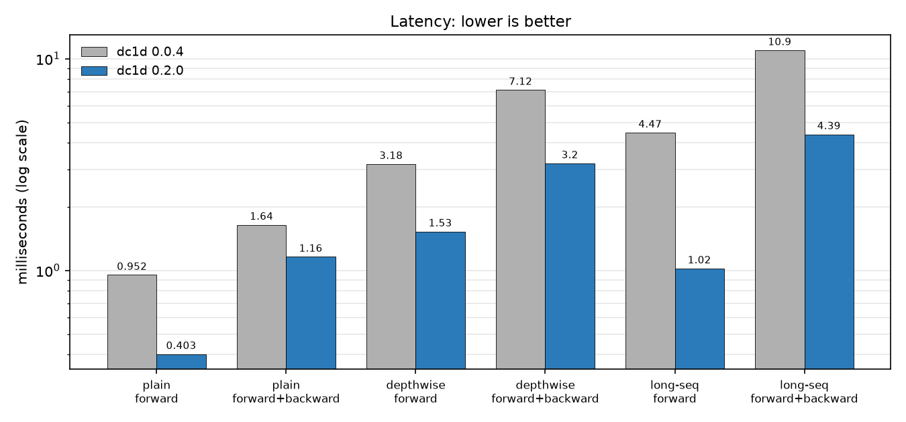
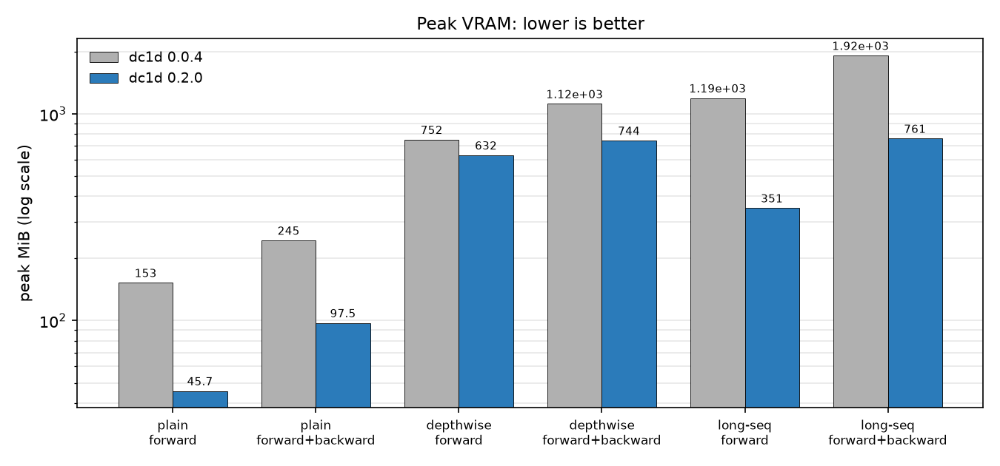
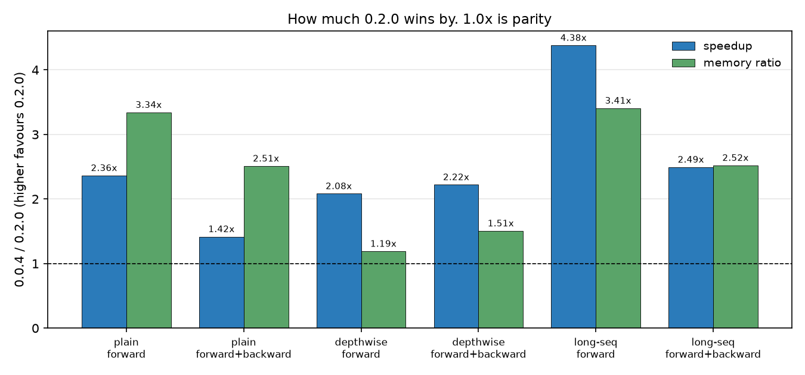

# 1D deformable convolution backends: a comparison

Four implementations of the same operator, measured against each other:
numerical equivalence (forward **and** both gradients), a defect cross-audit,
latency, and peak memory — **eager (§4) and under `torch.compile` (§5)**.

Everything here is reproduced by `benchmarks/backends.py`. Figures labelled
**measured** come from a run of that script on the hardware below; anything
labelled **estimated** is arithmetic, not measurement, and is marked as such.

```
uv sync --group bench
uv run --group bench python benchmarks/backends.py --check --defects   # CPU
.venv-cuda/bin/python benchmarks/backends.py --all --device cuda:0     # CUDA
CC=<a C compiler> .venv-cuda/bin/python benchmarks/backends.py \
    --compile-all --device cuda:0 --triton-overrides off               # §5
```

> **Read §5 before acting on §6.1.** The `grid_sample` recommendation was
> established in eager mode. Under `torch.compile` its forward advantage over
> dc1d's own kernel falls from **1.6–5.3×** to **≤ 13%**, which changes what the
> right default advice is. §5.9 then removes most of what was left: a custom
> `autograd.Function` for the backward does **not** close the latency gap, but
> it does close the **memory** gap, which was the other half of the case for
> `grid_sample`.

**Hardware and versions** (all measured figures below come from this machine):

```
torch            : 2.13.0+cu129        torchvision : 0.28.0+cu129
python           : 3.12.13             cuda (torch): 12.9     cudnn: 92000
gpu              : NVIDIA GeForce RTX 3090, sm_86, 24 GiB
cpu figures      : same box, torch 2.13.0+cpu (the dc1d dev venv)
tinymera ref     : fix/causality @ 04593f38, tinymera/ops/deform_conv1d.py
dtype            : float32 for all timing and memory; float64 for equivalence
triton overrides : DISABLED
```

> **Disclosure — Triton overrides off.** torch 2.13 ships Triton-DSL overrides
> for some ATen ops (notably `einsum` → `_bmm_outer_product`) that are JIT-built
> on first use. This machine has **no host C compiler**, so the first CUDA
> `einsum` raised `RuntimeError: Failed to find C compiler`, which would have
> excluded tinymera (both its kernels contract with `einsum`) from the
> comparison entirely. `backends.py` therefore deregisters the Triton overrides
> when no compiler is visible and says so in its environment banner. The switch
> is **global**, so every backend runs under the same dispatch regime and the
> comparison stays internally fair — but tinymera's absolute numbers are "ATen
> `bmm` fallback", not "best possible", and could improve on a box with a
> compiler. dc1d, torchvision and the `grid_sample` backend do not use `einsum`
> and are unaffected.


---

## 1. The four contenders

| | what it is | compiled? | offset groups | boundary | bit-exact vs `nn.Conv1d`? |
|---|---|---|---|---|---|
| **dc1d** | `gather` on an expanded index + `lerp` + `conv1d` (`dc1d/ops.py::_gather_pair`) | no | any divisor of `C` | clamp | **yes** |
| **torchvision** | `deform_conv2d` C++/CUDA kernel, height 1 | **yes** | any divisor of `C` | zero-pad | yes |
| **grid_sample** | `F.grid_sample` on `(B, C, 1, L)` (`benchmarks/backends.py`) | no (ATen builtin) | any divisor of `C` | clamp (`border`) | no |
| **tinymera** | independent 2nd implementation, two kernels | no | **fixed at `C`** | clamp | gather: yes; grid_sample: no |

### Algorithmic shape

All four compute the same thing: for output position `t` and kernel tap `k`,
sample the input at the fractional position

```
T[b, g, t, k] = t*stride + k*dilation + offset[b, g, t, k]
```

by linear interpolation between `floor(T)` and `floor(T)+1`, then contract the
`K` taps against the kernel weights. They differ in *how*:

* **dc1d** keeps `t*stride + k*dilation` in `long` and carries only the
  sub-sample fraction in float (`dc1d/ops.py::efficient_linterpolate`), then does two
  `gather` calls and one `lerp` (`dc1d/ops.py::_gather_pair`). The tap axis
  is flattened and contracted with a stride-`K` grouped `F.conv1d`
  (`dc1d/nn.py::DeformConv1d.forward`). The index handed to `gather` is an
  `expand`, a stride-0 view, so it is never tiled to the channel count — that
  is what makes `1 < offset_groups < C` work without a `C`-sized int64 index.
  Until 2026-08 this used `take_along_dim`, which broadcasts and achieves the
  same thing in the forward, but is not exportable to ONNX and materialised
  the index on the backward tape (§5.9.4a).
* **torchvision** does the whole thing in one fused kernel. Offsets are packed
  into the channel axis as `(offset_group, kh, kw, {y, x})`; with `kh = 1` the
  height interpolation is a no-op. The `(y, x)` ordering and the offset sign
  are **probed, not assumed** (`_probe_offset_layout`).
* **grid_sample** normalises `T` to `[-1, 1]` and calls
  `aten::grid_sampler_2d`. Offset groups are folded into the batch axis:
  `x` as `(B*G, C/G, 1, L)`, grid as `(B*G, 1, L_out*K, 2)`. The contraction is
  the same stride-`K` `conv1d` as dc1d, so any difference is attributable to
  the interpolation alone.
* **tinymera** ships both a `grid_sample` kernel and a `gather` kernel. Both
  fold `C` into the batch (`x.reshape(B*C_in, 1, 1, T_in)`), because offsets are
  always per-channel, and both contract with `torch.einsum` rather than
  `conv1d`.

### Verified `grid_sample` mechanics

The `grid_sample` backend rests on three claims that were checked rather than
assumed:

1. **`align_corners=True` gives exactly the `1-f` / `f` weights.** Sampling a
   unit impulse at `5 + f` returns exactly `1-f` for
   `f ∈ {0, 0.25, 0.5, 0.75}` in float64 (error `0`; at `f = 0.999` the error
   is `3.3e-16`, i.e. the round-trip through `g`, not the weight formula).
2. **`padding_mode='border'` reproduces dc1d's index clamp exactly.** For
   positions `-3, -0.5, 0, L-1, L-0.5, L+9` on a `1..L` ramp, `border` returns
   the clamped-reference value with error `0` in every case.
3. **`grid_sample` is an ATen builtin.** `torch.ops.aten.grid_sampler_2d`
   exists; nothing is compiled at import or at call time. **Adopting it would
   preserve dc1d's "no compilation required" property.**

---

## 2. Numerical equivalence

### 2.1 Anchor: zero offsets must reproduce `nn.Conv1d`

`--check` runs this across stride, dilation, groups and kernel size.

| backend | max abs error vs `nn.Conv1d`, float64 | bit-exact |
|---|---|---|
| dc1d | `0.000e+00` (every config) | **yes** |
| torchvision | `0.000e+00` (4/5 configs), `8.9e-16` (1/5) | effectively yes |
| grid_sample | `3.3e-14` – `6.2e-14` | **no** |
| tinymera-gather (fp32) | `0.000e+00` (4/5), `9.5e-07` (1/5) | effectively yes |
| tinymera-grid_sample (fp32) | `4.7e-05` – `8.0e-05` (~`4e-06` relative) | **no** |

The two `grid_sample`-based backends cannot hit this invariant, for a reason
that is structural, not a bug — see §2.4.

### 2.2 Interior equivalence, forward and both gradients

Random offsets in `±2`, restricted to output positions where every tap stays
inside `[0, L-1]`, so no boundary convention is in play. Ten configurations
covering stride, dilation, groups, offset groups, `K=1`, `K=7`, and `L=512`.
Gradients are taken against a common upstream gradient that is zeroed outside
the interior.

**float64, tolerance `1e-10` relative — all pass, 0 failures** (max over the 10
configurations, on the RTX 3090; values are `O(10)`):

| pair | forward | `d/d input` | `d/d offsets` |
|---|---|---|---|
| dc1d vs torchvision | `5.38e-13` | `5.76e-13` | `7.11e-15` |
| dc1d vs grid_sample | `1.15e-12` | `1.01e-12` | `1.42e-14` |

**The offset gradient — the entire point of a deformable layer — agrees to
float64 round-off in all three implementations.** `grid_sample` propagates
gradient into its grid correctly; `torch.autograd.gradcheck` in float64 against
both `input` and `offsets` passes for the `grid_sample` backend
(`_grid_sample_gradcheck`).

**float32, tolerance `1e-3` relative — all pass, 0 failures**, including both
tinymera kernels. Max forward error over the same 10 configurations:

| backend | max abs error | dc1d's own float32-vs-float64 error |
|---|---|---|
| torchvision | `2.74e-04` | `4.0e-07` – `7.1e-06` |
| grid_sample | `4.45e-04` | (same reference) |
| tinymera-gs | `5.51e-04` | |
| tinymera-gth | `2.74e-04` | |

The slacker tolerance is not a weaker claim about indexing:
at float32 the backends genuinely disagree at ~`1e-5` for three unavoidable
reasons (different accumulation order over the `K*C_in/groups` terms,
`grid_sample`'s normalisation, tinymera's internal downcast), while any
*structural* error — a mis-mapped offset group, an off-by-one clamp, an
inverted sign — is `O(1)` relative. dc1d's own float32-vs-float64 error is
printed per config so the floor is visible rather than asserted.

tinymera **cannot** be held to a float64 tolerance: see §3, defect D2.

### 2.3 Boundary semantics — where they genuinely differ

This is the one place the implementations are not the same operation.

Input `x = [1..12]`, `K=3`, tap 0 isolated, first four output positions:

| offset | dc1d (clamp) | grid_sample (`border`) | tinymera (clamp) | torchvision (zero-pad) |
|---|---|---|---|---|
| `-0.5` | `1.0, 1.5, 2.5, 3.5` | `1.0, 1.5, 2.5, 3.5` | `1.0, 1.5, 2.5, 3.5` | `0.5, 1.5, 2.5, 3.5` |
| `-3.0` | `1.0, 1.0, 1.0, 1.0` | `1.0, 1.0, 1.0, 1.0` | `1.0, 1.0, 1.0, 1.0` | `0.0, 0.0, 0.0, 1.0` |
| `+50.0` | `12.0, ...` | `12.0, ...` | `12.0, ...` | `0.0, ...` |

* **dc1d, grid_sample and tinymera all clamp** and agree with each other to
  `≤ 4.4e-16` (grid_sample) and **exactly `0`** (tinymera) at every offset
  tested. dc1d's clamp keeps the interpolation weights summing to 1 everywhere.
* **torchvision zero-pads.** An out-of-bounds bilinear tap contributes `0`, so
  a tap at `-0.5` reads `0.5 * x[0]` rather than `x[0]`, and differs at up to
  `10/10` positions for a large offset. Neither convention is wrong; they are
  different definitions and no tolerance will reconcile them.

**How much of the output is affected** (offsets `~ U(-r, r)`, `K=3`, `d=1`):

| L | r=1 | r=4 |
|---|---|---|
| 64 | 2/62 (3.2%) | 8/62 (12.9%) |
| 1024 | 2/1022 (0.20%) | 8/1022 (0.78%) |
| 16000 | 2/15998 (0.01%) | 8/15998 (0.05%) |

At speech-separation lengths the divergence is confined to ~0.01–0.05% of
positions. It is still a semantic difference, not a rounding difference.

**dc1d's constrained mode has no analogue anywhere else.** With
`unconstrained=False` (the default) each tap is confined to its own receptive
field. Against torchvision the interior error is then `1.1e+01` rather than
`4.0e-14` — as intended. Equivalence only holds against
`DeformConv1d(..., unconstrained=True)`.

### 2.4 The `grid_sample` precision tax

`grid_sample` requires coordinates normalised to `[-1, 1]` and un-normalises
internally as `(g + 1) / 2 * (L - 1)`. That `+ 1` is a catastrophic
cancellation for coordinates near the middle of the signal: an error of `eps`
in `g` becomes an error of `eps * (L - 1) / 2` **samples** in the recovered
position. No choice of grid construction avoids it — the backend here already
uses the exact-numerator form `(2T - (L-1)) / (L-1)`.

**Measured on the 3090** (zero offsets, so the exact answer is a plain
`unfold`; error should be `0`):

| dtype | L | dc1d max err | grid_sample max err | implied position err |
|---|---|---|---|---|
| float32 | 256 | `0` | `6.34e-05` | `6.7e-05` samples |
| float32 | 2048 | `0` | `4.80e-04` | `5.2e-04` samples |
| float32 | 16000 | `0` | `4.59e-03` | `4.9e-03` samples |
| float32 | 65536 | `0` | `2.22e-02` | `2.3e-02` samples |
| float16 | 256 | `0` | `6.10e-05` | `6.5e-05` samples |
| float16 | 2048 | `0` | `4.88e-04` | `5.3e-04` samples |
| float16 | 16000 | `0` | `4.15e-03` | `4.4e-03` samples |
| float16 | 65536 | `0` | `2.15e-02` | `2.3e-02` samples |

dc1d is bit-exact at every length and every dtype. `grid_sample`'s error grows
**linearly with L** and is essentially *dtype-independent* — it is the
normalisation, not the storage precision. In float32 it stays below `2.3e-2`
samples even at `L=65536`, which is tolerable for a layer whose offsets are
learned anyway, but it is not zero and the `nn.Conv1d` invariant is lost.

**The fp16 rows track the fp32 rows only because this backend forces the
position arithmetic to fp32.** Without that they are ~1000× worse — see §3, D1:
a naive version reads the wrong samples entirely at fp16/bf16 (~6x RMS(x)).

---

## 3. Defect cross-audit

dc1d fixed seven correctness bugs in `eac995f`. tinymera is a second
implementation of the same algorithm by the same author, so the question is
which classes recur. Probes are executable (`backends.py --defects`) except
where noted.

> **Not reproducible from this repository.** Only `tinymera/ops/deform_conv1d.py`
> is vendored here (`benchmarks/_tinymera_ref.py`). The **D5** and **D6b** rows
> below were measured against `tinymera/nn/deform_conv1d.py` in a private
> checkout, so `--defects` cannot re-run them and a reader cannot verify them.
> Two of the six grounds in the §6.3 recommendation rest on those rows; weigh
> them accordingly.

**tinymera reference**: `fix/causality` @ `04593f38` (open as tinymera PR #1
against `feature/exciting-plc`), which is "post-fix". "Pre-fix" is
`feature/exciting-plc` @ `ecf8da24`. Sources:
`tinymera/ops/deform_conv1d.py`, `tinymera/nn/deform_conv1d.py`.

| # | bug class | dc1d pre-fix | dc1d post-fix | tinymera pre-fix | tinymera post-fix |
|---|---|---|---|---|---|
| **D1** | dtype-inherited position arithmetic | **present** — `linspace` in offset dtype; 13952/15998 rows wrong at fp16, `L=16000` | fixed — window starts in `long`, only the fraction in float (`dc1d/ops.py::efficient_linterpolate`) | **present** — `torch.arange(T_out, dtype=x.dtype)` (both kernels) | fixed — forced `torch.float32` (`ops/deform_conv1d.py:110-111, 209-210`) |
| **D2** | float64 silently downcast | absent | absent — exact at every dtype | absent | **present (introduced by the D1 fix)** — `offsets.float()` and `x.float()`; measured `1.5e-05` error on a float64 input, i.e. float32-sized |
| **D3** | `repeat` vs `repeat_interleave` for offset groups | **present** — `U.repeat` tiled to `G*C`; `1 < G < C` raised `RuntimeError` | fixed — the `gather` index is an `expand`, channel axis viewed as `(G, C/G)` (`dc1d/ops.py::_gather_pair`) | **n/a — structurally unreachable** | **n/a** — offsets are always per-channel; there is no group→channel mapping to get wrong |
| **D4** | boundary clamp to `L` vs `L-1` | **present** — clamp to `x.shape[-1]`; at `T == L` *both* weights fell to 0, output exactly `0.0` | fixed — index clamped to `[0, L-2]`, fraction forced to 0/1 (`dc1d/ops.py::efficient_linterpolate`) | absent — `pos.clamp(0, T_in - 1)` was always correct | absent — verified: saturates to `x[L-1]` for a `1e6` offset |
| **D5** | stride/dilation dropped in the offset-prediction path | **present** — offset conv hardcoded `stride=1, dilation=1`; `stride=2, L=40` returned 38 instead of 19 | fixed — both forwarded (`dc1d/nn.py::PackedDeformConv1d.__init__`) | **present** | **STILL PRESENT (partial)** — `dilation` is forwarded, **`stride` is hardcoded to 1** (`nn/deform_conv1d.py:175-183`) |
| **D6** | the index clamp hides shape bugs (no contract validation) | **present** — wrong `L_out` produced plausible wrong-length output | fixed — `ValueError` against the closed form (`dc1d/nn.py::DeformConv1d.forward`), plus `expected_offset_positions()` | **present** | **STILL PRESENT** — sampling kernels take `T_out` from `offsets.shape` and clamp; nothing validates it |
| **D7** | `2^7`-style XOR-for-exponent | **present** — a benchmark ran `dilation=5` for three years | fixed — `2**7` (`dc1d/nn.py, the `__main__` demo block`) | absent | absent — `grep -rE '[0-9]\s*\^\s*[0-9]'` over the tree returns only a comment |

### D1 — the candidate `grid_sample` backend is exposed to this too

Worth stating plainly, because it bears on §6.1. `efficient_linterpolate` is
immune to D1 by construction: it keeps the window start in `long` and only the
sub-sample fraction ever touches the input dtype. **A `grid_sample` backend
cannot do that** — `grid_sample`'s only input is one normalised float
coordinate, so the integer part and the fraction must share a mantissa.

Measured on the 3090, zero offsets, `L=16000`, error as a fraction of `RMS(x)`:

| backend | float32 | float16 | bfloat16 | bit-exact? |
|---|---|---|---|---|
| dc1d | `0` | `0` | `0` | **yes, every dtype** |
| grid_sample (**naive**, inherits dtype) | `5.73e-03` | **`6.05`** | **`5.53`** | no |
| grid_sample (fp32 forced) | `5.73e-03` | `5.86e-03` | `7.82e-03` | no |
| tinymera-gs (fp32 forced) | `5.73e-03` | `5.86e-03` | `7.82e-03` | no |
| tinymera-gth | `0` | `0` | `0` | **yes** |

An error of `6× RMS(x)` means the sampling positions have collapsed and the
layer is reading unrelated parts of the sequence — silently, with no NaN. That
is dc1d's C3 verbatim. Forcing the arithmetic to fp32 (which tinymera's kernel
also does) brings it back to the normalisation floor, at which point the dtype
barely matters. **Any adopted `grid_sample` backend must do this from the first
commit.** Reproduce with
`benchmarks/backends.py --defects` (the forced rows) — the naive rows come from
deleting the `work = ...` upcast in `grid_sample_linterpolate`.

### D5 — reproduced

`tinymera.nn.DeformConv1d` builds its offset network with `stride=1`
(`nn/deform_conv1d.py:175-183`) but passes `self.stride` to the sampling kernel.
The offset network therefore emits `T_in` positions while the kernel needs
`T_out`, and the kernel silently uses `T_out = offsets.shape[2] = T_in`:

```
stride=1: tinymera out (2, 4, 64)   nn.Conv1d(same args) (2, 4, 64)   OK
stride=2: tinymera out (2, 4, 64)   nn.Conv1d(same args) (2, 4, 32)   WRONG
stride=4: tinymera out (2, 4, 64)   nn.Conv1d(same args) (2, 4, 16)   WRONG
```

The output is not merely the wrong length: the tail positions have
`nominal = t*stride` running past `T_in`, so they are all clamped to the last
input sample. This is **exactly** dc1d's C4, half-fixed. It survives because
`tests/nn/test_deform_conv1d.py` has **no stride coverage at all** — the
`stride` parametrisation exists only in the *ops*-level test, which computes
`T_out` correctly itself and so never exercises the module's offset network.

### D6b — the causal contract is also unvalidated (tinymera only)

Same class as D6, found while auditing. `causal=True` is only actually causal
when `2*padding >= dilation*(kernel_size-1)`, because the last tap must land on
the current step. Nothing checks it. Measured by
`d out[t] / d x[t'] for t' > t`, `K=3`, `d=4`, `C=4`, `T=64`:

| `padding` | contract wants | max `|d out[32] / d x[t'>32]|` | |
|---|---|---|---|
| 4 | ≥ 4 | `0.000e+00` | causal |
| 2 | ≥ 4 | `3.58e-01` | **leaks future context** |
| 0 | ≥ 4 | `4.45e-01` | **leaks future context** |

`causal=True` with the module's default `padding=0` is silently non-causal.
Worth raising on tinymera PR #1, which otherwise fixed the causality
violations correctly.

### Reading the table

Three of the seven classes recurred in the independent implementation (D1, D5,
D6), one was structurally impossible (D3), two never occurred (D4, D7), and the
fix for one introduced a new one (D2). **The correlated-mistake hypothesis
holds for the contract-validation classes specifically**: both implementations
independently let an unvalidated shape be absorbed by a boundary clamp (D6),
and both independently forgot to thread `stride` through the offset network
(D5). Those are the two to check first in any third implementation.

D2 is worth dwelling on: dc1d and tinymera fixed the *same* bug (D1) in
*different* ways, and tinymera's fix — force fp32 — is strictly weaker. It
solves the low-precision direction but makes float64 unavailable, which means
`torch.autograd.gradcheck` cannot be used on tinymera's kernels at all.
tinymera has no gradcheck test; dc1d's `tests/test_gradients.py` is float64
against both `input` and `offsets`. dc1d's decomposition (integers in `long`,
fraction in the input dtype) is exact at *every* dtype and is the better fix.


---

## 4. Performance

RTX 3090, float32, `torch.utils.benchmark.Timer` (`blocked_autorange`), forward
and forward+backward timed separately, **equal warmup (3 iterations) for every
contender**. Implementations are measured round-robin within each of 3 rounds so
all five see the same thermal state, and the reported figure is the **minimum**
across rounds. `spread` is max/min across rounds — the machine's noise floor.
The 3090 also drives the desktop, so rows with `spread > 1.5` are flagged and
their ratios should be read as order-of-magnitude.

Bracketed factors are **dc1d / contender**, so **> 1× means faster / smaller
than dc1d**.

### 4.1 Latency — forward (ms)

| config | dc1d | torchvision | grid_sample | tinymera-gs | tinymera-gth | nn.Conv1d | spread |
|---|---|---|---|---|---|---|---|
| B=1 C=16 L=256 K=3 d=1 g=1 | 0.298 | 0.219 (1.36×) | **0.181 (1.65×)** | 0.200 (1.49×) | 0.307 (0.97×) | 0.028 | 1.13 |
| B=4 C=64 L=1024 K=3 d=1 g=1 | 0.347 | 0.239 (1.45×) | **0.214 (1.62×)** | 0.223 (1.55×) | 0.349 (1.00×) | 0.043 | 1.13 |
| B=4 C=64 L=1024 K=3 d=1 g=64 | 0.284 | 1.302 (0.22×) | **0.164 (1.74×)** | 0.219 (1.30×) | 0.315 (0.90×) | 0.016 | 1.15 |
| B=4 C=256 L=2048 K=3 d=8 g=256 | 0.535 | 4.531 (0.12×) | **0.175 (3.05×)** | 0.845 (0.63×) | 1.884 (0.28×) | 0.051 | 1.02 |
| B=4 C=256 L=2048 K=3 d=8 g=1 | 0.708 | 0.369 (1.92×) | **0.345 (2.05×)** | 0.930 (0.76×) | 1.923 (0.37×) | 0.166 | 1.01 |
| B=4 C=128 L=4096 K=15 d=1 g=1 | 2.819 | **0.937 (3.01×)** | 1.048 (2.69×) | 4.055 (0.70×) | 8.736 (0.32×) | 0.327 | 1.02 |
| B=4 C=128 L=4096 K=15 d=1 g=128 | 2.253 | 2.475 (0.91×) | **0.428 (5.27×)** | 3.681 (0.61×) | 8.489 (0.27×) | 0.071 | 1.08 |
| B=4 C=128 L=4096 K=3 d=2 g=1 | 0.320 | 0.218 (1.47×) | **0.197 (1.63×)** | 0.253 (1.26×) | 0.542 (0.59×) | 0.052 | 1.11 |
| B=4 C=128 L=4096 K=3 d=1 g=1 ⚠ | 0.704 | 0.282 (2.50×) | **0.266 (2.65×)** | 0.892 (0.79×) | 1.881 (0.37×) | 0.132 | 2.50 |
| B=1 C=256 L=16000 K=3 d=1 g=256 | 1.104 | 4.635 (0.24×) | **0.289 (3.82×)** | 1.439 (0.77×) | 3.494 (0.32×) | 0.120 | 1.16 |
| B=4 C=256 L=16000 K=3 d=8 g=256 | 4.476 | 4.074 (1.10×) | **0.978 (4.58×)** | 7.677 (0.58×) | 14.303 (0.31×) | 0.526 | 1.34 |
| B=1 C=256 L=16000 K=3 d=1 g=1 | 1.491 | 1.333 (1.12×) | **0.670 (2.22×)** | 2.415 (0.62×) | 3.920 (0.38×) | 0.396 | 1.02 |
| B=8 C=512 L=8000 K=3 d=1 g=512 ⚠ | 24.126 | **7.795 (3.09×)** | 11.361 (2.12×) | 13.055 (1.85×) | 30.731 (0.79×) | 1.258 | 2.83 |

### 4.2 Latency — forward+backward (ms)

| config | dc1d | torchvision | grid_sample | tinymera-gs | tinymera-gth | nn.Conv1d | spread |
|---|---|---|---|---|---|---|---|
| B=1 C=16 L=256 K=3 d=1 g=1 | 0.760 | 0.631 (1.20×) | **0.503 (1.51×)** | 0.649 (1.17×) | 0.994 (0.76×) | 0.214 | 1.19 |
| B=4 C=64 L=1024 K=3 d=1 g=1 | 0.850 | 0.667 (1.27×) | **0.572 (1.49×)** | 0.709 (1.20×) | 1.592 (0.53×) | 0.279 | 1.13 |
| B=4 C=64 L=1024 K=3 d=1 g=64 | 0.749 | 4.056 (0.18×) | **0.471 (1.59×)** | 0.698 (1.07×) | 1.579 (0.47×) | 0.187 | 1.15 |
| B=4 C=256 L=2048 K=3 d=8 g=256 | 1.546 | 15.178 (0.10×) | **0.684 (2.26×)** | 1.761 (0.88×) | 12.336 (0.13×) | 0.201 | 1.08 |
| B=4 C=256 L=2048 K=3 d=8 g=1 | 2.220 | 1.579 (1.41×) | **1.347 (1.65×)** | 2.078 (1.07×) | 12.518 (0.18×) | 1.087 | 1.03 |
| B=4 C=128 L=4096 K=15 d=1 g=1 | 7.074 | 4.600 (1.54×) | **3.222 (2.20×)** | 8.948 (0.79×) | 54.685 (0.13×) | 1.832 | 1.04 |
| B=4 C=128 L=4096 K=15 d=1 g=128 | 8.939 | 7.959 (1.12×) | **4.842 (1.85×)** | 7.851 (1.14×) | 53.676 (0.17×) | 0.303 | 1.10 |
| B=4 C=128 L=4096 K=3 d=2 g=1 | 0.842 | 0.665 (1.27×) | **0.575 (1.47×)** | 0.720 (1.17×) | 3.632 (0.23×) | 0.295 | 1.15 |
| B=4 C=128 L=4096 K=3 d=1 g=1 | 2.272 | 2.150 (1.06×) | **1.090 (2.09×)** | 2.858 (0.80×) | 13.889 (0.16×) | 0.588 | 1.34 |
| B=1 C=256 L=16000 K=3 d=1 g=256 ⚠ | 3.511 | 30.786 (0.11×) | **1.466 (2.39×)** | 3.721 (0.94×) | 25.805 (0.14×) | 0.423 | 2.10 |
| B=4 C=256 L=16000 K=3 d=8 g=256 | 13.763 | 14.418 (0.95×) | **5.246 (2.62×)** | 16.938 (0.81×) | 103.925 (0.13×) | 1.534 | 1.38 |
| B=1 C=256 L=16000 K=3 d=1 g=1 ⚠ | 5.806 | **3.082 (1.88×)** | 3.997 (1.45×) | 3.740 (1.55×) | 24.789 (0.23×) | 1.358 | 1.51 |
| B=8 C=512 L=8000 K=3 d=1 g=512 | 52.321 | 46.588 (1.12×) | **36.281 (1.44×)** | 42.446 (1.23×) | 235.131 (0.22×) | 3.801 | 1.15 |

### 4.3 Peak CUDA memory (MiB, `torch.cuda.max_memory_allocated`)

Reset **after** input construction, so this is the transient the op itself
allocates, not the inputs. Forward / forward+backward:

| config | dc1d | torchvision | grid_sample | tinymera-gs | tinymera-gth |
|---|---|---|---|---|---|
| B=4 C=256 L=2048 K=3 d=8 g=256 | 104.9 / 280.1 | 47.8 / 56.0 | **31.9 / 64.1** | 183.9 / 207.9 | 288.0 / 520.8 |
| B=4 C=128 L=4096 K=15 d=1 g=128 | 497.2 / 1337.4 | **143.9 / 153.8** | 128.0 / 257.8 | 856.2 / 976.2 | 1440.3 / 2542.3 |
| B=1 C=256 L=16000 K=3 d=1 g=256 | 205.6 / 548.4 | 94.9 / 95.2 | **62.9 / 126.1** | 313.7 / 360.6 | 564.0 / 973.6 |
| B=4 C=256 L=16000 K=3 d=8 g=256 | 821.1 / 2191.3 | 375.3 / 439.3 | **250.4 / 502.3** | 1439.7 / 1627.7 | 2249.4 / 4072.6 |
| B=1 C=256 L=16000 K=3 d=1 g=1 | 205.6 / 549.1 | **94.9 / 96.0** | 126.9 / 190.5 | 313.7 / 360.6 | 564.0 / 1021.5 |
| B=8 C=512 L=8000 K=3 d=1 g=512 | 5188.6 / 5938.6 | **749.8 / 1625.8** | 2624.6 / 2624.6 | 2874.6 / 3249.5 | 4499.9 / 8149.5 |

Full 13-row tables: run `--mem`.

### 4.4 What the numbers say

**`grid_sample` beats dc1d in every configuration measured, on both axes.**

| | forward | forward+backward |
|---|---|---|
| latency, dc1d / grid_sample | **1.62× – 5.27×** (13/13 wins, median ~2.2×) | **1.44× – 2.62×** (13/13 wins, median ~1.7×) |
| peak memory, dc1d / grid_sample | **1.62× – 3.89×** (13/13) | **2.26× – 5.19×** (13/13) |

This comfortably exceeds the 1.5–2× dc1d's own review estimated. The win is
largest exactly where dc1d is used in anger: depthwise, dilated, long sequences
(`C=256 L=16000 g=256`: **4.58×** forward, **3.28×** less memory).

**torchvision's compiled kernel does *not* win decisively — it is erratic.**
It is the fastest option in 2/13 forward configs, but it is *4–10× slower than
pure-PyTorch dc1d* in several depthwise configs (`0.10×`, `0.11×`, `0.12×`,
`0.18×`, `0.22×`, `0.24×`). Those are precisely the Conv-TasNet-shaped configs
this package exists for. Its memory use is consistently excellent (up to 8.7×
below dc1d), which is what a fused kernel should buy — but the latency is not
reliably there.

**tinymera is slower than dc1d in most configs and never beats
dc1d+`grid_sample`.** `tinymera-gs` is faster than dc1d in 4/13 forward and
5/13 fwd+bwd configs; `dc1d + grid_sample` beats `tinymera-gs` in **13/13**
forward, 12/13 fwd+bwd, and **13/13** on forward memory. The gap is structural:
tinymera folds *all* channels into the batch (`x.reshape(B*C_in, 1, 1, T_in)` —
`B*C_in` single-channel grids) because it has no `offset_groups`, and contracts
with `einsum` instead of a grouped `conv1d`. `tinymera-gth` is the slowest thing
here by a wide margin — up to **7.5× slower than dc1d** on fwd+bwd
(`103.9 ms` vs `13.8 ms`) — and uses 2–3× more memory.

### 4.5 The two prior claims, checked

**(a) "tinymera materialises a `(B, C, K, T)` intermediate costing ~393 MB per
layer per forward at Conv-TasNet dimensions."**

*Arithmetic: correct.* At `B=8, C=512, K=3, T=8000` (`T_out=7998`), fp32:
`8 × 512 × 3 × 7998 × 4 B = 393,043,968 B` = **374.8 MiB = 393 MB**. Confirmed.

*As a reason to avoid it: does not survive measurement.* That tensor is only
**13%** of tinymera-gs's measured forward peak (2874.6 MiB) — the `pos`, `off`,
`grid_x` and `grid` intermediates cost more than the sampled tensor does. More
importantly **dc1d allocates 5188.6 MiB at the same config, 1.8× more than
tinymera**, because it materialises `x0`, `x1` *and* the `lerp` output at that
same `(B, C, L_out, K)` shape. If a 393 MB intermediate is disqualifying, dc1d
is disqualified first. The claim is true and misleading; it is not why tinymera
should be retired (§3 is).

**(b) "dc1d's rewrite cut peak RSS ~3× on CPU."**

*Verified.* Same config as TODO.md (`B=4 C=256 L=2048 K=3 d=8`, 23.8 MiB
output), peak RSS delta in isolated subprocesses, torch 2.13.0+cpu:

| | peak RSS delta |
|---|---|
| pre-rewrite (`eac995f^:dc1d/ops.py`) | **291.0 MiB** |
| current | **99.8 MiB** |
| reduction | **2.92×** |

TODO.md records 283 → 91 MiB = 3.1×; this run gives 2.92×. Agreement within
run-to-run RSS variation. **Note:** the rewrite is in commit `eac995f`
("Fix seven correctness bugs and remove dead code"), *not* in `50a9bed`, whose
message claims the rewrite but which touches only `benchmarks/benchmark.py`.
The commit messages and their contents are misaligned in that pair.


---

## 5. Under `torch.compile`

Everything in §4 was measured in **eager mode**, and that is not a neutral
choice. `grid_sample` is a single opaque ATen kernel: Inductor can call it but
cannot fuse anything into it. dc1d's kernel is the opposite — two
`take_along_dim` gathers wrapped in a `floor`/`clamp`/`sub`/`where`/`lerp`
elementwise chain, which is exactly the shape Inductor exists to fuse. If dc1d's
kernel is memory-bandwidth-bound rather than compute-bound, compilation should
help it *more*, and the §4 comparison may be measuring the wrong thing.

This became testable only after PR #9. `DeformConv1d.forward` used to mutate
`self.device`, which forced a graph break; with that gone and
`dilated_positions` a non-persistent buffer, `torch._dynamo.explain` reports
**0 graph breaks / 1 graph** and every compilation below runs with
`fullgraph=True`.

Reproduce with:

```
CC=<a C compiler> .venv-cuda/bin/python benchmarks/backends.py \
    --compile-all --device cuda:0 --triton-overrides off
```

> **Two disclosures about the environment.**
>
> 1. **A C compiler had to be introduced.** Triton builds a small CUDA driver
>    shim with `$CC` on first use, so Inductor cannot run at all on this box as
>    configured. The measurements use `zig cc` from the `ziglang` PyPI wheel —
>    self-contained, installed into the throwaway CUDA venv, nothing added to
>    the system.
> 2. **`--triton-overrides off` is load-bearing.** `maybe_disable_triton_overrides`
>    keys off the presence of a compiler, so simply installing one would have
>    flipped torch 2.13's Triton ATen overrides from *disabled* (how §4 was
>    measured) to *enabled*, silently re-dispatching ops for **every** backend.
>    Pinning them off keeps the dispatch regime byte-identical to §4 and leaves
>    `torch.compile` as the only variable that moved. The check that this
>    worked is in the tables themselves: the eager `dc1d` and `gs` columns below
>    are fresh measurements, and they reproduce §4.1 to within a few percent.

Notation: `/c` is `torch.compile(mode="default")`, `/ma` is
`mode="max-autotune"`. Bracketed factors are **eager dc1d / variant**, so
`> 1×` means faster than the eager default kernel. ⚠ marks rows where a second
independent run disagreed by more than 20% — see §5.8.

### 5.1 Latency — forward (ms)

| config | dc1d | dc1d/c | grid_sample | grid_sample/c | torchvision/c |
|---|---|---|---|---|---|
| B=1 C=16 L=256 K=3 d=1 g=1 | 0.304 | 0.130 (2.33×) | 0.178 (1.71×) | **0.113 (2.69×)** | 0.241 (1.26×) |
| B=4 C=64 L=1024 K=3 d=1 g=1 | 0.317 | 0.133 (2.38×) | 0.196 (1.62×) | **0.127 (2.49×)** | 0.241 (1.31×) |
| B=4 C=64 L=1024 K=3 d=1 g=64 | 0.287 | 0.111 (2.59×) | 0.165 (1.74×) | **0.105 (2.73×)** | 1.777 (0.16×) |
| B=4 C=256 L=2048 K=3 d=8 g=256 | 0.533 | **0.143 (3.74×)** | 0.177 (3.01×) | 0.147 (3.64×) | 6.402 (0.08×) |
| B=4 C=256 L=2048 K=3 d=8 g=1 | 0.703 | **0.289 (2.43×)** | 0.344 (2.05×) | 0.294 (2.39×) | 0.362 (1.94×) |
| B=4 C=128 L=4096 K=15 d=1 g=1 | 2.798 | 1.150 (2.43×) | 1.032 (2.71×) | 1.126 (2.48×) | **0.920 (3.04×)** |
| B=4 C=128 L=4096 K=15 d=1 g=128 ⚠ | 2.181 | 0.555 (3.93×) | **0.424 (5.15×)** | 0.530 (4.12×) | 3.405 (0.64×) |
| B=4 C=128 L=4096 K=3 d=2 g=1 | 0.321 | 0.136 (2.35×) | 0.197 (1.62×) | **0.130 (2.47×)** | 0.250 (1.29×) |
| B=4 C=128 L=4096 K=3 d=1 g=1 ⚠ | 0.698 | 0.241 (2.90×) | 0.264 (2.64×) | **0.237 (2.95×)** | 0.275 (2.54×) |
| B=1 C=256 L=16000 K=3 d=1 g=256 | 0.989 | 0.289 (3.42×) | **0.260 (3.80×)** | 0.280 (3.53×) | 6.556 (0.15×) |
| B=4 C=256 L=16000 K=3 d=8 g=256 ⚠ | 3.753 | 1.100 (3.41×) | **0.821 (4.57×)** | 1.119 (3.35×) | 5.905 (0.64×) |
| B=1 C=256 L=16000 K=3 d=1 g=1 ⚠ | 1.311 | 0.568 (2.31×) | 0.581 (2.25×) | **0.558 (2.35×)** | 0.707 (1.85×) |
| B=8 C=512 L=8000 K=3 d=1 g=512 ⚠ | 24.042 | 2.630 (9.14×) | 11.590 (2.07×) | **2.395 (10.04×)** | 11.348 (2.12×) |

### 5.2 Latency — forward+backward (ms)

| config | dc1d | dc1d/c | grid_sample | grid_sample/c | torchvision/c |
|---|---|---|---|---|---|
| B=1 C=16 L=256 K=3 d=1 g=1 | 0.785 | 0.425 (1.85×) | 0.478 (1.64×) | **0.400 (1.97×)** | 0.674 (1.16×) |
| B=4 C=64 L=1024 K=3 d=1 g=1 | 0.799 | 0.471 (1.70×) | 0.520 (1.54×) | **0.454 (1.76×)** | 0.667 (1.20×) |
| B=4 C=64 L=1024 K=3 d=1 g=64 | 0.752 | 0.464 (1.62×) | 0.470 (1.60×) | **0.425 (1.77×)** | 4.637 (0.16×) |
| B=4 C=256 L=2048 K=3 d=8 g=256 | 1.540 | 0.996 (1.55×) | 0.681 (2.26×) | **0.647 (2.38×)** | 18.366 (0.08×) |
| B=4 C=256 L=2048 K=3 d=8 g=1 | 2.210 | 1.637 (1.35×) | 1.343 (1.65×) | **1.276 (1.73×)** | 1.569 (1.41×) |
| B=4 C=128 L=4096 K=15 d=1 g=1 ⚠ | 6.970 | 4.717 (1.48×) | 3.148 (2.21×) | **3.090 (2.26×)** | 4.546 (1.53×) |
| B=4 C=128 L=4096 K=15 d=1 g=128 | 8.700 | 6.459 (1.35×) | 4.797 (1.81×) | **4.767 (1.83×)** | 9.367 (0.93×) |
| B=4 C=128 L=4096 K=3 d=2 g=1 | 0.867 | 0.540 (1.61×) | 0.589 (1.47×) | **0.510 (1.70×)** | 0.750 (1.16×) |
| B=4 C=128 L=4096 K=3 d=1 g=1 ⚠ | 1.896 | 1.541 (1.23×) | 0.917 (2.07×) | **0.884 (2.14×)** | 1.211 (1.57×) |
| B=1 C=256 L=16000 K=3 d=1 g=256 ⚠ | 2.907 | 1.935 (1.50×) | **1.162 (2.50×)** | 1.219 (2.38×) | 25.417 (0.11×) |
| B=4 C=256 L=16000 K=3 d=8 g=256 | 11.104 | 7.533 (1.47×) | **4.347 (2.55×)** | 4.700 (2.36×) | 17.863 (0.62×) |
| B=1 C=256 L=16000 K=3 d=1 g=1 | 5.684 | 4.627 (1.23×) | 3.932 (1.45×) | 3.911 (1.45×) | **2.789 (2.04×)** |
| B=8 C=512 L=8000 K=3 d=1 g=512 ⚠ | 44.757 | 20.923 (2.14×) | 23.590 (1.90×) | **15.758 (2.84×)** | 41.919 (1.07×) |

### 5.3 What the numbers say

**The hypothesis holds. Compilation helps dc1d's kernel a lot and `grid_sample`
barely at all.**

| | dc1d → dc1d/c | grid_sample → grid_sample/c |
|---|---|---|
| forward | **2.31× – 9.14×** (13/13 faster) | **0.73× – 4.84×** (9/13 faster; *slower* in 4) |
| forward+backward | 1.23× – 2.14× (13/13) | 1.03× – 1.50× (13/13) |

Compiling `grid_sample` is a **regression** at four of the larger forward
configurations — `wide-kernel` (0.92×), `wide-kernel-dw` (0.80×),
`speech-1x256` (0.93×) and `speech-4x256` (0.73×). There is nothing for
Inductor to fuse into `aten::grid_sampler_2d`, so what it adds is bookkeeping.
dc1d's chain, by contrast, collapses into the gather epilogues exactly as
predicted: §5.5 shows the forward going from **27 CUDA kernel launches to 4**.

**Forward: the gap essentially closes.**

| | eager (§4.1) | compiled (§5.1) |
|---|---|---|
| grid_sample vs dc1d, forward | **1.62× – 5.27×**, 13/13 wins | **1.03× – 1.15×**, 10/13 wins |

Once both are compiled the largest remaining forward margin is **13%**
(`tiny`), the median is **~4%**, and dc1d/c is actually *faster* in 3 of 13
(`medium`, `medium-dense`, `speech-4x256`). A 1.6–5.3× advantage has become a
few percent.

**Forward+backward: the gap narrows but does not close.**

| | eager (§4.2) | compiled (§5.2) |
|---|---|---|
| grid_sample vs dc1d, fwd+bwd | **1.44× – 2.62×**, 13/13 wins | **1.04× – 1.74×**, 13/13 wins |

`grid_sample/c` still wins every configuration, by 4%–74% (median ~33%). The
backward is where dc1d pays: autograd differentiates through gather + lerp and
must store `x0`, `x1` and `frac`, and the resulting scatter-adds fuse far less
well than the forward — 66 launches to 31, against the forward's 27 to 4.
**This is the single most valuable place to look next**, and it is already a
deferred item in `TODO.md`: a custom autograd `Function` for the interpolation
needs only the integer index and `frac`, not `x0` and `x1`.

**torchvision's compiled kernel is unchanged and still erratic** — 0.08×–3.04×
against eager dc1d, catastrophic in the depthwise configurations. Inductor
cannot improve an opaque custom op, which is the point.

### 5.4 `max-autotune` is not reliable here

Capped grid (5 configurations), eager and both modes measured in the same
round-robin. **Forward (ms):**

| config | dc1d | dc1d/c | dc1d/ma | gs | gs/c | gs/ma |
|---|---|---|---|---|---|---|
| B=4 C=64 L=1024 K=3 d=1 g=1 | 0.320 | **0.134** | 0.143 | 0.198 | 0.127 | 0.137 |
| B=4 C=256 L=2048 K=3 d=8 g=256 | 0.537 | **0.145** | 0.153 | 0.178 | 0.150 | 0.154 |
| B=4 C=128 L=4096 K=15 d=1 g=128 | 2.195 | **0.603** | 0.916 | 0.426 | 0.621 | 1.187 |
| B=4 C=256 L=16000 K=3 d=8 g=256 | 3.770 | **1.210** | 1.542 | 0.911 | 2.151 | 2.209 |
| B=1 C=256 L=16000 K=3 d=1 g=1 | 1.317 | **0.583** | 0.762 | 0.582 | 0.604 | 0.836 |

**Forward+backward (ms):**

| config | dc1d | dc1d/c | dc1d/ma | gs | gs/c | gs/ma |
|---|---|---|---|---|---|---|
| B=4 C=64 L=1024 K=3 d=1 g=1 | 0.852 | 0.530 | **0.402** | 0.584 | 0.517 | 0.384 |
| B=4 C=256 L=2048 K=3 d=8 g=256 | 1.552 | **1.005** | 1.050 | 0.694 | 0.685 | 0.726 |
| B=4 C=128 L=4096 K=15 d=1 g=128 | 8.735 | 6.487 | **6.432** | 4.832 | 4.795 | 4.828 |
| B=4 C=256 L=16000 K=3 d=8 g=256 | 12.927 | **8.989** | 9.046 | 5.210 | 5.747 | 5.992 |
| B=1 C=256 L=16000 K=3 d=1 g=1 | 5.669 | **4.628** | 4.693 | 3.914 | 3.899 | 3.975 |

**`max-autotune` ≥ `default` does not hold.** It loses to plain `default` in
**8 of 10** measurements above, sometimes badly (`wide-kernel-dw` forward:
0.916 vs 0.603 ms). It wins exactly once by a margin worth having — `small`
forward+backward, 0.402 vs 0.530 ms.

It is also **not reproducible**. The same five configurations were measured
twice; `default` agreed with itself to within 12%, `max-autotune` did not:

| config, forward | run A | run B | ratio |
|---|---|---|---|
| dc1d/ma, `medium` | 0.694 ms | 0.153 ms | **4.5×** |
| gs/ma, `medium` | 1.262 ms | 0.154 ms | **8.2×** |
| dc1d/ma, `wide-kernel-dw` | 0.542 ms | 0.916 ms | 1.7× |

In run A, `dc1d/ma` at `medium` was **slower than eager** (0.694 vs 0.536 ms,
i.e. 0.77×). Inductor logs
`skipping cudagraph due to ... exceeding max re-recording limit` and
`out of resource: triton_depthwise_conv1d` during these compilations, so the
mode is silently falling back to different kernels between runs.

And it is **expensive**. From a cold cache (fresh process, empty Inductor and
Triton caches, `B=4 C=256 L=16000 K=3 d=8 g=256`):

| backend / mode | fwd | fwd+bwd |
|---|---|---|
| dc1d / default | **3.1 s** | **8.5 s** |
| dc1d / max-autotune | **212.1 s** | **224.8 s** |
| grid_sample / default | 3.4 s | 4.1 s |
| grid_sample / max-autotune | 207.4 s | 212.4 s |

Warm — same process, same shape already in the on-disk FX-graph cache —
`default` costs 0.16–1.2 s per (config, phase). **`max-autotune` costs
3.5 minutes per shape to buy a result that is usually worse and never
reproducible. Do not use it for this operator.**

### 5.5 Kernel launches — settling the "~25 → ~5" claim

`TODO.md` has carried "~25 kernels → ~5" for the kernel rewrite as a **static
reading of the diff**, never a profile. Profiled here with
`torch.profiler(activities=[CUDA])`, one warmed call, `B=4 C=64 L=4096 K=3
d=1 g=1`:

| what | fwd | fwd+bwd |
|---|---|---|
| `efficient_linterpolate`, pre-rewrite (`eac995f^`) | **26** | 57 |
| `efficient_linterpolate`, current | **23** | 44 |
| `grid_sample_linterpolate` | 14 | 23 |
| full layer: dc1d, eager | 27 | 66 |
| full layer: grid_sample, eager | 17 | 42 |
| full layer: dc1d, **compiled** | **4** | 31 |
| full layer: grid_sample, **compiled** | **4** | 28 |

**The claim is half right, and the wrong half is the important one.** "~25" is
accurate — the pre-rewrite kernel launches 26. "~5" is not: the current eager
kernel launches **23**, a 12% reduction, not a 5×. The rewrite's win was
memory (2.9× peak RSS, §4.5b) and correctness, not launch count.

**~5 is real, but `torch.compile` is what delivers it**: 27 → 4 for the whole
forward. That is also the mechanism behind §5.3 — the elementwise chain and
both gathers collapse into essentially one fused kernel plus the contraction.
Note the compiled dc1d and compiled `grid_sample` forwards launch **the same
number of kernels (4)**, which is why their compiled latencies are within a few
percent: after fusion they are doing the same amount of memory traffic.

The backward tells the other half of the story: dc1d 66 → 31 versus
`grid_sample` 42 → 28. dc1d's backward starts 1.6× behind and stays there.

### 5.6 Shapes: every sequence length is a new compile

dc1d exists for speech separation, where utterances have different lengths.
`B=4 C=128 K=3`, five lengths in sequence, counting `unique_graphs`:

| regime | graphs after 5 lengths | compile per new length | steady state at L=4096 |
|---|---|---|---|
| static (default) | **5** (1 per length) | 0.3 – 1.3 s | **0.255 ms** |
| `torch.compile(dynamic=True)` | **5** (1 per length) | 0.3 – 0.5 s | 0.440 ms |
| `maybe_mark_dynamic(length)` | **5** (1 per length) | 0.3 s | 0.529 ms |
| `mark_dynamic(length)` | — | — | **raises** |

**Dynamic shapes are not available for this kernel.** `mark_dynamic` fails
outright with

```
ConstraintViolationError: You marked L['a'][0].size()[2] as dynamic but your
code specialized it to be a constant (1024).
  File "dc1d/ops.py", line 184, in efficient_linterpolate
    x0 = torch.take_along_dim(xg, idx, dim=3).reshape(
```

and the two softer regimes do not raise only because they are permitted to
specialise silently — which they do, recompiling once per length exactly like
the static default, while making the steady state **1.7–2.1× slower** for the
privilege. So the honest accounting for a variable-length workload is: pay
~0.3 s of Inductor compile per distinct length, and keep the static speedups.
For a job with a handful of bucketed lengths that is nothing; for one that
sees arbitrary lengths it is a real tax, and it is a **deferred fix** — the
specialisation is in `efficient_linterpolate`'s `reshape` to
`out_length * kernel_size`, not something Dynamo could not handle in principle.

### 5.7 Does compilation preserve exactness?

This is the question that decides whether any of the above matters. dc1d's
kernel is preferred over `grid_sample` *because* it is bit-exact against
`nn.Conv1d`; a compiled kernel that quietly gives that up would be no better
than `grid_sample`. Checked with `--compile-check`, on a stream of **distinct**
inputs (four different tensors per configuration, with an assertion that
consecutive eager outputs differ, so a one-call lag cannot pass unnoticed), and
run **separately from any timing loop**:

| check | `default` | `max-autotune` |
|---|---|---|
| interpolation forward vs eager, fp32 and fp64, 3 configs | **bit-exact, 12/12** | **bit-exact, 12/12** |
| interpolation gradients vs eager | ≤ 1.8e-07 rel (fp32), ≤ 2.8e-16 (fp64) | same |
| whole layer vs eager, fp32 | ≤ 1.0e-07 rel | ≤ 1.0e-07 rel |
| `nn.Conv1d` invariant, fp64, zero offsets | bit-exact 2/3; **2 ulp** in the grouped config | identical |
| `gradcheck` (input, offsets), fp64 | **PASS** | **PASS** |

**The sampling is untouched.** Splitting the interpolation from the contraction
is what makes this readable: the interpolation forward is bit-exact at every
configuration and both dtypes, so Inductor's fusion does not move where the
layer reads. Every residual difference is in the grouped `F.conv1d`
contraction, which Inductor reassociates — a float32 sum reordered in the last
ulp, and in float64 a 2-ulp (`4.4e-16`) departure from `nn.Conv1d` in the
`groups=8` case.

That 2 ulp is not nothing: `tests/test_equivalence.py` asserts **bit**-exactness,
and under `torch.compile` with `groups > 1` it would fail as written. It is a
reassociated sum, not a mis-indexed gather — but the test's whole value is that
it does not accept "close enough", so this should be recorded as a documented
limit of compiling the layer rather than papered over with a tolerance.

### 5.8 Reproducibility

The `default` sweep was run twice, independently, three rounds each.

* **Eager columns cross-validate against §4.1**: `dc1d` agrees with the
  eager-only table to within 3% on 11/13 forward rows, and `grid_sample` to
  within 5% on 11/13. That is the evidence that `--triton-overrides off` really
  did hold the dispatch regime fixed.
* **Run-to-run**: 8/13 forward rows agree to within 4% on every column. Five do
  not, and are marked ⚠ in §5.1/§5.2. The worst is `convtasnet-H512`, where
  `dc1d/c` came out 2.63 ms and 5.09 ms in the two runs and `grid_sample`
  11.59 ms and 22.76 ms — a factor of two, on the largest configuration in the
  grid. The 3090 also drives this machine's desktop (Chrome holds a GPU
  process), which §4 already flags.
* The **conclusions do not depend on the noisy rows.** `dc1d/c` and
  `grid_sample/c` are within 13% of each other on forward in *both* runs
  including `convtasnet-H512` (2.63 vs 2.40, and 5.09 vs 4.88), and
  `grid_sample/c` wins fwd+bwd in 13/13 in both.

### 5.9 A custom `autograd.Function` for the backward

§5.3 named the backward as the entire remaining gap to `grid_sample` and §5.5
gave the mechanism: the forward compiles **27 → 4** kernel launches, the
backward only **66 → 31**. The identified fix — carried in `TODO.md` since —
was a custom `autograd.Function`, on the grounds that autograd differentiates
through `take_along_dim` and `lerp` and stores `x0` and `x1` where the offset
gradient only ever needs their difference.

Two variants are now in `dc1d/ops.py`, selectable with
`efficient_linterpolate(..., gather_lerp=...)`. Both compute the identical
forward, and `tests/test_equivalence.py` asserts it bit-for-bit across
stride × dilation × offset_groups × constrained/unconstrained:

| `gather_lerp` | what the backward keeps | `dL/dx` | `dL/d offsets` |
|---|---|---|---|
| `'autograd'` (default) | whatever autograd decides | `take_along_dim` backward ×2 | `lerp` backward |
| `'save-diff'` | index, fraction, `x1 - x0` | one fused `scatter_add_` | `sum_c g·(x1-x0)` |
| `'recompute'` | index, fraction, `x` | one fused `scatter_add_` | re-gathers, then as above |

Reproduce with:

```
CC=<a C compiler> .venv-cuda/bin/python benchmarks/backends.py \
    --backward --device cuda:0 --triton-overrides off
```

#### 5.9.1 The admissibility check: graph breaks

dc1d's best measured result is the **2.3–9.1×** it gets from `torch.compile`,
and that rests on the layer tracing to one graph with no breaks. A naively
written `autograd.Function` is opaque to Dynamo, so a faster eager backward
bought with a reintroduced graph break would be a net loss. Checked with
`torch._dynamo.explain` before and after, plus a `fullgraph=True` compile with
both gradients taken:

| variant | interpolation | whole layer | `fullgraph=True` |
|---|---|---|---|
| `autograd` (before) | 1 graph, 0 breaks | 1 graph, 0 breaks | PASS |
| `save-diff` | 1 graph, 0 breaks | 1 graph, 0 breaks | PASS |
| `recompute` | 1 graph, 0 breaks | 1 graph, 0 breaks | PASS |

**No `allow_in_graph` was needed.** Dynamo traces `autograd.Function.apply`
into an `autograd_function_apply` higher-order op and inlines both the forward
and the hand-written backward, so Inductor still sees the whole thing. That is
also the first hint at the result below: if Inductor can see the hand-written
backward, it can also see — and has already applied — the optimisation the
hand-written backward was supposed to deliver.

#### 5.9.2 Kernel launches — the answer, in one table

`B=4 C=64 L=4096 K=3 d=1 g=1`, one warmed call, `torch.profiler`:

| variant | eager fwd | eager fwd+bwd | compiled fwd | **compiled fwd+bwd** |
|---|---|---|---|---|
| `autograd` | 27 | 66 | 4 | **30** |
| `save-diff` | 27 | 64 | 4 | **30** |
| `recompute` | 27 | 69 | 4 | **30** |

**The compiled backward does not move.** All three land on exactly 30 launches.
AOTAutograd's min-cut partitioner already re-derives this schedule from the
generic graph; writing the backward by hand tells Inductor nothing it had not
worked out. The 66 → 31 figure §5.5 blamed for the gap is 66 → 30 here and it
is 30 whatever the backward is written in.

Eager, the hand-written backward is worth **2 launches** (66 → 64) for
`save-diff` and costs **3** (66 → 69) for `recompute`, which pays two extra
gathers.

#### 5.9.3 Latency

**Eager** (`dc1d`/`save-diff`/`recompute` only, so the round-robin is short):

| | forward | forward+backward |
|---|---|---|
| `save-diff` vs default | 0.94 – 1.01× | **0.92 – 1.01×** |
| `recompute` vs default | 0.85 – 1.01× | **0.77 – 0.90×** |

Neither is faster. `save-diff` is a wash to 8% slower; `recompute` costs
10–23%, which is the price of the two extra gathers. The forward differences at
the small configurations are `autograd.Function.apply`'s dispatch overhead
(~40 µs), visible only because those configurations are 0.3 ms.
`convtasnet-H512` is excluded from the ranges — it read 0.5× in this sweep and
1.0× in three others; see §5.8.

**Compiled**, forward+backward (ms), minimum over three independent runs:

| config | dc1d/c | sd/c | gs/c | gs/c vs dc1d/c | gs/c vs sd/c |
|---|---|---|---|---|---|
| B=1 C=16 L=256 K=3 d=1 g=1 | 0.414 | 0.420 | 0.444 | 0.93× | 0.95× |
| B=4 C=64 L=1024 K=3 d=1 g=1 | 0.468 | 0.471 | 0.456 | 1.03× | 1.03× |
| B=4 C=64 L=1024 K=3 d=1 g=64 | 0.434 | 0.439 | 0.421 | 1.03× | 1.04× |
| B=4 C=256 L=2048 K=3 d=8 g=256 | 0.887 | 0.791 | 0.654 | 1.36× | 1.21× |
| B=4 C=256 L=2048 K=3 d=8 g=1 | 1.534 | 1.419 | 1.287 | 1.19× | 1.10× |
| B=4 C=128 L=4096 K=15 d=1 g=1 ⚠ | 4.168 | 4.178 | 3.129 | 1.33× | 1.34× |
| B=4 C=128 L=4096 K=15 d=1 g=128 | 5.895 | 5.858 | 4.799 | 1.23× | 1.22× |
| B=4 C=128 L=4096 K=3 d=2 g=1 | 0.500 | 0.525 | 0.514 | 0.97× | 1.02× |
| B=4 C=128 L=4096 K=3 d=1 g=1 ⚠ | 1.447 | 1.292 | 0.884 | 1.64× | 1.46× |
| B=1 C=256 L=16000 K=3 d=1 g=256 | 1.979 | 1.833 | 1.413 | 1.40× | 1.30× |
| B=4 C=256 L=16000 K=3 d=8 g=256 | 7.745 | 7.066 | 5.383 | 1.44× | 1.31× |
| B=1 C=256 L=16000 K=3 d=1 g=1 | 4.462 | 4.223 | 3.913 | 1.14× | 1.08× |
| B=8 C=512 L=8000 K=3 d=1 g=512 ⚠ | 20.544 | 22.344 | 15.828 | 1.30× | 1.41× |

`sd/c` is 0.92–1.12× of `dc1d/c` — it wins by 6–12% in the five configurations
where the tape is largest, and is a wash elsewhere. `recompute` compiled is
indistinguishable from `save-diff` compiled, as §5.9.2 predicts.

**Against the target:** `grid_sample/c` still wins forward+backward in
**12 of 13**, and the gap only narrows:

| | vs `dc1d/c` (default backward) | vs `sd/c` (custom Function) |
|---|---|---|
| range | 0.93 – 1.64× | 0.95 – 1.46× |
| mean | **1.26×** | **1.19×** |
| median | 1.23× | 1.21× |

**The custom Function removes roughly a quarter of the mean gap and leaves
three quarters.** It does not close it, and §5.9.2 says why: there was no
launch-count headroom left to take.

> **Protocol note.** These are measured with a **reversed round-robin on
> alternate rounds**, added to `bench_compile_config` for this section. Plain
> round-robin controls for drift *between* rounds but not *within* one: with
> seven variants and a card that heats over a ~10 s round, whatever is measured
> last is penalised in every round, and min-across-rounds cannot remove a bias
> that is present in every round. The first sweeps showed the later columns
> degrading together on exactly the configurations whose spread was worst,
> which is a position effect and not a property of the variants. The three runs
> tabulated above agree with each other to within 5% on 11/13 rows; the three
> marked ⚠ do not, and `convtasnet-H512` remains the worst, exactly as §5.8
> found.

#### 5.9.4 Memory — where the Function actually pays

> **Superseded in part, 2026-08.** Everything in this subsection measures the
> `take_along_dim` forward, which is no longer the default: `_gather_pair` now
> uses `torch.gather` on an expanded index (see §5.9.4a for why, and for what
> the numbers become). The **7.02× figure below is a property of
> `take_along_dim`, not of the `autograd` variant**, and it is now 3.02–3.35×.
> `save-diff` and `recompute` are unaffected. The tables are kept as measured
> because they are the baseline §5.9.4a is a delta against.

Latency is not the figure of merit for this operator. dc1d is
memory-bandwidth-bound and peak memory is what caps batch size and sequence
length in the speech-separation regime it exists for. The quantity that
differs is what is **held between the forward and the backward**, and it can be
read directly rather than inferred from a peak:

| config (output size) | `autograd` | `save-diff` | `recompute` |
|---|---|---|---|
| `B=4 C=64 L=1024 K=3 d=1 g=1`, og=1 (3.0 MiB) | 21.0 MiB = **7.02× out** | 6.2 MiB = 2.05× | 3.2 MiB = **1.05×** |
| `B=4 C=256 L=2048 K=3 d=8 g=256`, og=256 (23.8 MiB) | 203.8 MiB = 8.56× | 132.0 MiB = 5.54× | 107.8 MiB = 4.53× |
| `B=4 C=128 L=4096 K=15 d=1 g=1`, og=1 (119.6 MiB) | 841.4 MiB = **7.04× out** | 243.3 MiB = 2.03× | 122.9 MiB = **1.03×** |

The 7.02× decomposes exactly: the output, `x0`, `x1`, **and two full-size int64
indices**. `take_along_dim` broadcasts its index for the forward, but its
*backward* saves that broadcast index materialised — 8 bytes per output element,
twice, i.e. 4× the fp32 output. That is the same "`gather` does not broadcast"
allocation `CLAUDE.md` warns about, reappearing on the backward side where the
forward rewrite never looked. The custom Function keeps the compact
`(B, G, 1, L_out·K)` index instead, which is why `recompute` holds essentially
nothing beyond the output it must return.

The `og=256` row is the exception and it is instructive: with one offset group
per channel the "compact" index is no longer compact (2× the output in int64,
plus the fraction at 1×), so the saving is 8.56× → 4.53× rather than → 1.03×.
The index compaction pays in proportion to `channels / offset_groups`.

Peak `max_memory_allocated` for one forward+backward, which is what a user
actually hits (MiB; bracketed factor is eager-`dc1d` / variant, so > 1× is
smaller). **These figures are bit-identical across four independent runs** —
the allocator is deterministic, unlike the timings:

| config | dc1d | dc1d/c | sd | sd/c | rc | rc/c | gs/c |
|---|---|---|---|---|---|---|---|
| B=1 C=16 L=256 K=3 d=1 g=1 | 0.6 | 0.3 | 0.3 | 0.2 | 0.3 | 0.2 | 0.1 |
| B=4 C=64 L=1024 K=3 d=1 g=1 | 35.1 | 25.3 | 20.4 (1.72×) | 13.3 (2.63×) | 18.4 (1.91×) | 13.3 | 12.4 |
| B=4 C=64 L=1024 K=3 d=1 g=64 | 35.0 | 21.0 | 20.3 (1.72×) | 11.3 (3.11×) | 18.3 (1.91×) | 11.3 | 8.1 |
| B=4 C=256 L=2048 K=3 d=8 g=256 | 280.1 | 167.9 | 160.6 (1.74×) | 88.5 (3.17×) | 144.6 (1.94×) | 88.5 | 72.1 |
| B=4 C=256 L=2048 K=3 d=8 g=1 | 280.3 | 203.2 | 161.4 (1.74×) | 107.2 (2.61×) | 145.0 (1.93×) | 107.2 | **107.4** |
| B=4 C=128 L=4096 K=15 d=1 g=1 | 1337.1 | 877.2 | 744.2 (1.80×) | 397.2 (3.37×) | 631.8 (2.12×) | 397.2 | **398.9** |
| B=4 C=128 L=4096 K=15 d=1 g=128 | 1337.4 | 744.4 | 743.3 (1.80×) | 381.1 (3.51×) | 630.8 (2.12×) | 381.1 | 266.1 |
| B=4 C=128 L=4096 K=3 d=2 g=1 | 76.2 | 60.5 | 46.5 (1.64×) | 36.5 (2.09×) | 48.5 (1.57×) | 36.5 | **36.6** |
| B=4 C=128 L=4096 K=3 d=1 g=1 | 282.4 | 206.7 | 171.4 (1.65×) | 110.7 (2.55×) | 155.4 (1.82×) | 110.7 | **111.5** |
| B=1 C=256 L=16000 K=3 d=1 g=256 | 548.4 | 329.8 | 315.1 (1.74×) | 173.9 (3.15×) | 283.2 (1.94×) | 173.9 | 142.1 |
| B=4 C=256 L=16000 K=3 d=8 g=256 | 2191.3 | 1313.0 | 1255.8 (1.74×) | 691.6 (3.17×) | 1130.2 (1.94×) | 691.6 | 564.8 |
| B=1 C=256 L=16000 K=3 d=1 g=1 | 549.1 | 394.2 | 315.5 (1.74×) | 206.2 (2.66×) | 284.0 (1.93×) | 206.2 | **206.5** |
| B=8 C=512 L=8000 K=3 d=1 g=512 | 5938.6 | 3314.7 | 5937.7 (1.00×) | 3939.7 (1.51×) | 5688.6 (1.04×) | 3939.7 | 2249.9 |

* **Eager: 1.6–1.8× (`save-diff`) and 1.6–2.1× (`recompute`) lower peak**, in
  12 of 13 configurations.
* **Compiled: 1.3–1.9× lower** than `dc1d/c`, which is the surprise —
  AOTAutograd's partitioner is *not* already doing this, even though §5.9.2
  shows it emitting the same number of kernels either way.
* **Against `grid_sample/c` the memory gap essentially closes**: `sd/c`/`rc/c`
  reach parity in **5 of 13** (bolded above — within 1%) and are within 20% in
  four more. Compare `dc1d/c`, which uses **1.5–2.8×** more memory than
  `grid_sample/c` everywhere.
* The exception is `convtasnet-H512`, where the peak is set by a forward
  transient (5188 MiB of the 5939 MiB peak is reached before the backward
  starts), so shrinking the tape is invisible to the high-water mark.

#### 5.9.4a `gather` on an expanded index — the 2026-08 default change

`_gather_pair` was changed from `take_along_dim` to `torch.gather` on an
explicitly `expand`ed index. The motive was correctness, not memory:
`take_along_dim` decomposes to a negative-index wrap whose modulus the ONNX
exporter freezes at the export-time length, so exported models read the wrong
samples at any longer input (`CLAUDE.md`, `tests/test_export.py`). The forward
is bit-identical, `torch.equal` in 27 of 27 configurations across all three
`gather_lerp` modes. But it also moves the memory numbers above, so they are
re-measured here.

**Hardware differs from the rest of this document.** These are on an
**A100-SXM4-80GB**, torch 2.13.0+cu129, not the RTX 3090 used elsewhere, and
**the GPU was shared with another job at 50–100% utilisation throughout**.
Memory is unaffected by that (the allocator is deterministic, and the
`take_along_dim` column below reproduces §5.9.4 to the decimal: 21.0 MiB /
7.02×, 203.8 MiB / 8.56×), which is what licenses the comparison. **Latency
under contention is indicative only** and is reported as such.

**The mechanism, read off the tape directly** (`small`, output 2.99 MiB). Both
forms decompose to the same `GatherBackward0`; only the saved index differs:

```
take_along_dim    _saved_index stride=(196224,196224,3066,1)   5.988 MiB
gather on expand  _saved_index stride=(3066,3066,0,1)          0.094 MiB
```

Channel stride **3066 versus 0**. `take_along_dim` broadcasts by materialising a
real copy before dispatching to gather; handing `gather` an explicit `expand`
keeps the stride-0 view all the way onto the tape. This is the answer to the
question §5.9.4 left open, and it is the opposite of the concern that motivated
the original `take_along_dim` choice.

Held between forward and backward, `autograd` mode, as a multiple of the output:

| config | offset groups | `take_along_dim` | `gather` |
|---|---|---|---|
| `B=4 C=64 L=1024`, og=1 | og < C | 7.02× | **3.09×** |
| `B=4 C=256 L=2048 d=8`, og=1 | og < C | 7.06× | **3.05×** |
| `B=4 C=128 L=4096`, og=8 | og < C | 7.10× | **3.35×** |
| `B=1 C=256 L=16000`, og=1 | og < C | 7.02× | **3.02×** |
| `B=4 C=64 L=1024`, og=64 | og == C | 8.50× | 8.50× |
| `B=4 C=256 L=2048 d=8`, og=256 | og == C | 8.56× | 8.57× |
| `B=8 C=512 L=8000`, og=512 | og == C | 8.50× | 8.50× |

The new 3.0× decomposes exactly as the old 7.0× did: output, `x0`, `x1`, the
compact index, the fraction. The four extra multiples were precisely the two
materialised int64 indices, and they are gone.

Peak `max_memory_allocated`, one forward+backward, factor is `take_along_dim` /
`gather`, so > 1× means the new default is smaller:

| config | offset groups | eager | compiled |
|---|---|---|---|
| `B=4 C=64 L=1024`, og=1 | og < C | 1.56× | 2.45× |
| `B=4 C=256 L=2048 d=8`, og=1 | og < C | 1.57× | 2.48× |
| `B=4 C=128 L=4096`, og=8 | og < C | 1.51× | 2.21× |
| `B=1 C=256 L=16000`, og=1 | og < C | 1.57× | 2.48× |
| depthwise offsets (og == C), 4 configs | og == C | 1.24× | 1.00× |

**Two consequences, and the second one matters more than the first.**

1. `offset_groups < channels` improves across the board, 1.5–1.6× eager and
   2.2–2.5× compiled, for free. `offset_groups == channels` gains only a
   forward transient: the expand is an identity there so nothing is broadcast,
   but `take_along_dim` still allocated its index copy while the original was
   alive (isolated probe, output 2.99 MiB: 23.95 MiB transient versus 14.97 MiB,
   a difference of exactly 3× the output). The tape is unchanged, so compiled
   shows nothing.

2. **`recompute`'s memory case is materially weaker than §5.9.4 documents**, for
   the configurations where the new default already won. Against the old default
   `recompute` was worth 1.6–2.1× eager peak; against the new one it is 1.30× on
   `B=4 C=64 L=1024` (21.2 MiB versus 16.3 MiB) rather than 1.91×. Where
   `offset_groups == channels` it keeps its full value, because that is exactly
   where the new default gains nothing. `save-diff` and `recompute` are
   themselves unchanged, 18 of 18 rows identical to within 0.2 MiB: their
   forwards run inside an `autograd.Function` with grad disabled, so
   `_gather_pair` never builds a tape there.

**Latency, indicative only** (contended GPU; both sides identically warmed,
reversed round-robin, min across 9–10 rounds). CUDA eager favours `gather` in 34
of 36 rows, 1.0–1.5× on the interpolation forward; the two exceptions (0.98×,
0.99×) are inside their own round spread. Compiled is a wash on the forward, as
expected since Inductor generates its own indexing and never sees
`take_along_dim`; the only sub-0.9× readings failed to reproduce across two
dedicated repeats. On **CPU** the gain is real but strongly shape-dependent: the
isolated `_gather_pair` forward is 2.2–9.9× at one thread, but the honest
user-facing figure is the whole layer, at **1.15–4.53× forward** and
**1.15–1.85× forward+backward**, and the depthwise configurations get close to
nothing (1.05×). A single-shape CPU speedup quoted on its own will mislead in
either direction.

#### 5.9.5 What a custom Function costs

Both restrictions below were found by writing a test, not by reasoning, and
both are the kind of thing that would have shipped silently:

* **`vmap` / `torch.func`.** An `autograd.Function` is opaque to functorch
  unless it declares `setup_context` **and** `generate_vmap_rule`. Without
  them `torch.vmap(layer)` raises, where the pure-ATen kernel simply works.
  `recompute` declares both and is verified against a manual `stack` of
  per-sample calls. `save-diff` structurally cannot: `setup_context` is handed
  only the inputs and the outputs, and the tensor it wants to save is an
  intermediate.
* **Double backward.** `save-diff` stores `x1 - x0` as a *constant*, so under
  `create_graph=True` the second-order term `d(dL/d offsets)/dx` comes out
  **zero instead of correct** — silently. `recompute` re-derives it from the
  saved input and is exact. `save-diff` therefore raises rather than answering
  wrongly.

`recompute` is consequently the only one of the two that could ever be a
default. `save-diff` earns its place as a measurement, separating the cost of
the saved difference from the cost of the recomputation, and is documented as
such.

#### 5.9.6 Correctness and determinism

| check | result |
|---|---|
| forward vs default, bit-exact, 18 configurations × both variants | **`torch.equal`, 36/36** |
| `gradcheck` float64, input **and** offsets, constrained + unconstrained, og ∈ {1,2,4} | **PASS, 18/18** (3 variants × 6) |
| both gradients vs the default backward, float64 | ≤ 1e-12 |
| `tests/test_equivalence.py` (`nn.Conv1d` invariant) | **unchanged and green** |
| `torch.vmap` parity | PASS (`autograd`, `recompute`) |
| double backward non-zero | PASS (`autograd`, `recompute`) |

**Determinism.** `dL/dx` is a scatter-add. On CUDA it accumulates with atomics,
so it is not bitwise reproducible run to run — measured, and true of **all
three variants including the existing one**, because `take_along_dim`'s
backward is the same scatter-add. `dL/d offsets` is a plain reduction and is
reproducible. Under `torch.use_deterministic_algorithms(True)` PyTorch
substitutes a deterministic `scatter_add_` rather than raising, and all three
become bitwise reproducible:

| variant | default mode | `use_deterministic_algorithms(True)` |
|---|---|---|
| `autograd` | `dL/dx` differs, `dL/d offsets` equal | both bitwise equal, no error |
| `save-diff` | `dL/dx` differs, `dL/d offsets` equal | both bitwise equal, no error |
| `recompute` | `dL/dx` differs, `dL/d offsets` equal | both bitwise equal, no error |

So the custom Function introduces no determinism regression, and no
`deterministic=` opt-out is needed.

#### 5.9.7 Verdict

**The custom `autograd.Function` does not close the latency gap to
`grid_sample`, because there was no launch-count headroom left to take** —
Inductor already partitions the generic graph into the same 30-kernel backward
it produces from the hand-written one, and eager the hand-written backward is a
wash (`save-diff`) or 10–23% slower (`recompute`).

**It does close the memory gap, which is arguably the more useful half.** It
takes the tape from 7.0× the output tensor to 1.03×, cuts peak forward+backward
memory 1.6–2.1× eager and 1.3–1.9× compiled, and brings `dc1d` to parity with
`grid_sample` on memory in 5 of 13 configurations where it was previously
1.5–2.8× worse.

> **Superseded in part, 2026-08.** Every ratio in this paragraph is measured
> against the `take_along_dim` default, which no longer exists. The default now
> holds **3.0–3.4×** the output where `offset_groups < channels`, so
> `recompute`'s remaining advantage there is about **1.30×**, not 1.6–2.1×. At
> `offset_groups == channels` the tape is unchanged at 8.5× and the paragraph
> stands. See §5.9.4a.

Therefore: **shipped as an opt-in, not adopted as the default.** The default
stays `'autograd'` because `'recompute'` — the only variant safe to make a
default, per §5.9.5 — costs 10–23% of eager forward+backward, and most users of
this package do not compile. Under `torch.compile` it is strictly better
(0–12% faster *and* 1.3–1.9× smaller) and should be the recommendation.

#### 5.9.8 Idle-GPU spot check of §5.1/§5.2

Some of §5's numbers were taken while an unrelated job held `cuda:0`. Four
configurations re-measured with both cards quiet, same flags:

| config, fwd+bwd (ms) | §5.2 dc1d/c | now | §5.2 gs/c | now |
|---|---|---|---|---|
| B=4 C=256 L=2048 K=3 d=8 g=256 | 0.996 | 0.897 | 0.647 | 0.661 |
| B=4 C=128 L=4096 K=15 d=1 g=128 | 6.459 | 5.901 | 4.767 | 4.805 |
| B=1 C=256 L=16000 K=3 d=1 g=1 | 4.627 | 4.627 | 3.911 | 4.026 |
| B=8 C=512 L=8000 K=3 d=1 g=512 ⚠ | 20.923 | 31.826 | 15.758 | 25.032 |

**Three of the four reproduce to within 10% and the ordering is unchanged in
all four**, so §5.1/§5.2 stand as written and are not re-run. The exception is
`convtasnet-H512`, which came out **1.5–1.6× slower on the idle card** — the
opposite of what contention would predict, and the same row §5.8 already
flagged as 2× apart between two runs. Its spread is intrinsic to the
configuration (5 GiB peak, power/clock limited), not an artefact of a busy GPU;
it should keep its ⚠ and should not carry any conclusion.

---

## 6. Recommendation

### 6.1 Should dc1d adopt a `grid_sample` backend? — **Yes, but the case is now much narrower.**

> **Revised again after §5.9.** `grid_sample`'s surviving case rested on two
> things: it was faster forward+backward under compilation, and it used
> 1.5–2.8× less memory. **The memory half is gone.** With
> `gather_lerp='recompute'`, compiled dc1d reaches memory parity with
> `grid_sample/c` in 5 of 13 configurations and comes within 20% in four more,
> while keeping the `nn.Conv1d` bit-exactness invariant that `grid_sample`
> cannot have. The latency half survives, reduced: `grid_sample/c` still wins
> forward+backward 12/13, but by a mean of **19%** rather than 26% (§5.9.3).
>
> So the recommendation narrows once more:
>
> * **`torch.compile` + `gather_lerp='recompute'` is now the default advice**
>   for anyone who can compile — though see §5.9.4a: the 2026-08 gather rewrite
>   took most of the memory saving into the default, leaving `recompute` worth
>   ~1.30× where `offset_groups < channels`. It is 0–12% faster and 1.3–1.9×
>   smaller than
>   compiled dc1d with the stock backward, keeps the sampling bit-exact, and
>   supports `vmap` and double backward.
> * **`grid_sample` is now only for the case where forward+backward *latency*
>   is the bottleneck** and the exactness loss is acceptable — a mean 19%, not
>   the 1.4–2.6× the eager §4 numbers suggest.
> * If you will not compile, `grid_sample` still buys 1.6–5.3× on the forward,
>   and that case is unchanged.

> **Revised after §5.** The original recommendation rested on `grid_sample`
> winning **13/13** configurations by 1.6–5.3× on forward. Every one of those
> numbers was measured in eager mode. Under `torch.compile`, which the layer now
> supports with zero graph breaks, **the forward advantage all but disappears:
> ≤ 13%, median ~4%, and dc1d wins 3 of 13** (§5.3). The forward case for giving
> up bit-exactness is gone. What survives is the **backward**, where
> `grid_sample` still wins 13/13 by 4–74% even with both compiled — and the
> no-compilation property, which matters precisely for the users who will never
> run `torch.compile`.
>
> The revised recommendation, therefore:
>
> * **Still adopt it, still opt-in** — the eager numbers in §4 are real, and a
>   user who cannot or will not compile gets 1.6–5.3× forward for a documented
>   loss of exactness.
> * **Do not present it as the fast path.** For anyone willing to call
>   `torch.compile`, `interpolation_function=grid_sample_linterpolate` buys
>   ~4% on forward and costs the `nn.Conv1d` invariant. Documentation should say
>   so plainly: **compile first, and only reach for `grid_sample` if the
>   backward is your bottleneck.**
> * **`torch.compile` is the better first recommendation for the default
>   kernel** — 2.3–3.9× forward and 1.2–1.9× fwd+bwd on the well-behaved
>   configurations, with the sampling bit-exact against eager (§5.7) and
>   `gradcheck` passing.

The original eager-mode case, unchanged, is below.

* **It is faster and smaller in 13/13 configurations** *in eager mode*, forward
  and forward+backward: 1.6–5.3× faster forward, 1.4–2.6× faster fwd+bwd,
  1.6–3.9× less forward memory, 2.3–5.2× less fwd+bwd memory. dc1d's own review
  estimated 1.5–2×; the measured win is larger. **Compiled, the forward margin
  falls to ≤ 13% (§5.1) and only the fwd+bwd margin survives (§5.2).**
* **It requires no compilation.** `torch.ops.aten.grid_sampler_2d` is an ATen
  builtin — verified present, nothing is built at import or at call time. This
  was the deciding constraint and it is satisfied. **dc1d's "no C++/CUDA
  compilation" property is preserved.**
* **The offset gradient is correct.** `gradcheck` in float64 against both
  `input` and `offsets` passes, and the gradients match dc1d's to `≤ 1.4e-14`
  (`d/d offsets`) and `≤ 1.0e-12` (`d/d input`). This is the thing that had to
  be true; it is.
* **Boundary semantics are identical.** `padding_mode='border'` reproduces
  dc1d's index clamp exactly (error `0` at every probed offset), so adopting it
  changes no boundary behaviour.
* It supports `offset_groups` (folded into the batch axis) and dc1d's
  constrained mode, so it is a true drop-in for `efficient_linterpolate`.

**But not as the default.** Two things are lost:

1. **The `nn.Conv1d` bit-exactness invariant.** `grid_sample`'s `[-1, 1]`
   normalisation is lossy and the error grows linearly with `L`
   (`4.6e-3` at `L=16000`, `2.3e-2` at `L=65536`, in *samples* of position
   error). `tests/test_equivalence.py` — which CLAUDE.md correctly calls the
   single load-bearing test — **cannot** be applied to this backend bit-exactly.
   That test is what made the 3× kernel rewrite safe to attempt; giving it up by
   default would be a bad trade for a 2× speedup.
2. **Low-precision safety, unless explicitly defended.** A naive `grid_sample`
   backend that inherits the input dtype **reintroduces dc1d's C3 bug**: measured
   at `L=16000`, it read the wrong samples entirely — error **6.05× RMS(x)** at
   fp16 and **5.53×** at bf16. Forcing the position and sampling arithmetic to at
   least float32 fixes it (error drops to `5.9e-3` / `7.8e-3`, the normalisation
   floor). This is not optional and must be in the implementation from day one —
   it is the same class of bug the package has already paid for once.

**What would change if adopted:**

* Add `grid_sample_linterpolate` to `dc1d/ops.py` (~45 lines, no new
  dependency, no new import beyond `torch.nn.functional`). `DeformConv1d`
  already takes `interpolation_function`, so no API change is needed —
  `DeformConv1d(..., interpolation_function=grid_sample_linterpolate)` is the
  whole opt-in.
* `tests/test_equivalence.py` stays as-is for the default kernel. Add a
  tolerance-based variant for the new one, with the tolerance a documented
  function of `L`, and a regression test pinning the fp32 forcing (assert the
  bf16 error stays at the normalisation floor, not the collapsed value).
* `tests/test_gradients.py` applies unchanged and passes.
* README/CLAUDE.md need a short "choosing a backend" note: **exactness by
  default, `torch.compile` for speed, `grid_sample` only if the backward is the
  bottleneck and the exactness loss is acceptable.**

### 6.2 Is a fused Triton kernel worth writing? — **Still no, and now for a better reason.**

The original argument was that torchvision's hand-written C++/CUDA kernel does
not beat pure PyTorch reliably, so a fused kernel is not obviously worth the
build step:

* torchvision is fastest in only 2/13 forward configs, and is **4–10× slower
  than pure-PyTorch dc1d** in six of them — all depthwise, which is the regime
  dc1d exists for. Compiling it changes nothing (§5.1): Inductor cannot fuse
  into an opaque custom op.
* `grid_sample`, an ATen builtin with no build step, beats torchvision in 10/13
  forward configs.

**§5 replaces that argument with a stronger one: Inductor already writes the
fused kernel.** The compiled forward is **4 CUDA kernel launches**, down from 27
(§5.5), and it lands within a few percent of `grid_sample`'s while keeping the
sampling bit-exact. A hand-written Triton kernel would have to beat *that*, and
it would have to be shipped as source, breaking the no-compilation property —
whereas `torch.compile` is opt-in at the call site and costs nothing to anyone
who does not use it.

**Where the remaining headroom actually is: the backward — and it has now been
tried.** §5.9 wrote the custom autograd `Function` this section recommended.
It does **not** close the latency gap: the compiled backward launches **30**
kernels whether the backward is hand-written or derived by autograd, because
AOTAutograd's partitioner already reaches that schedule from the generic graph.
Eager it is a wash or slower. What it does buy is memory — the tape drops from
**7.0× the output tensor to 1.03×** — which closes most of `grid_sample`'s
*memory* advantage but none of its latency advantage. (The 7.0× figure is the
pre-2026-08 `take_along_dim` default; the current default is 3.0–3.4× at
`offset_groups < channels`, so less of that closing is left to `recompute`.
§5.9.4a.)

**That strengthens the case against Triton rather than weakening it.** The
cheap software fix has been applied and the remaining gap survived it, so what
is left is genuinely kernel-level. But a hand-written kernel would now have to
beat a compiled backward that is already at 30 launches and holding almost
nothing, would ship as source, and would break the no-compilation property —
for a mean 19% on forward+backward, in an operator whose users can get the
memory win for free with one keyword.

**And do not reach for `mode="max-autotune"`.** It lost to `mode="default"` in
8 of 10 measurements, was slower than *eager* in one, varied by up to 4.5×
between two runs of the same configuration, and costs ~3.5 minutes per shape
from a cold cache (§5.4).

### 6.3 Should the two repos' implementations be unified? — **Yes: retire tinymera's.**

`tinymera.nn.DeformConv1d` / `tinymera.ops.deform_conv1d` should be replaced by
a dependency on dc1d. Grounds, in order of severity:

1. **`stride > 1` is silently wrong** (§3, D5) — wrong output length, tail
   positions clamped to the last input sample, no test coverage.
2. **`causal=True` silently leaks future context** whenever
   `2*padding < dilation*(K-1)`, including at the module's default `padding=0`
   (§3, D6b). Measured `|d out[32] / d x[t'>32]| = 0.36`.
3. **No contract validation anywhere** (§3, D6) — the same clamp-hides-shape-bugs
   pattern dc1d fixed.
4. **float64 unavailable** (§3, D2), so `gradcheck` cannot be run on it, and it
   has no gradcheck test. For a layer whose whole purpose is the offset
   gradient, that is the most serious gap after (1) and (2).
5. **No `offset_groups`** — hardwired to per-channel, dc1d's most expensive
   setting, with no way to trade offset resolution for memory.
6. **It is slower and more memory-hungry**: `dc1d + grid_sample` beats
   `tinymera-gs` in 13/13 forward configs on both latency and memory, and
   `tinymera-gth` is the slowest implementation measured.

The one capability tinymera has that dc1d lacks is a **causal mode**, and it is
worth having. The recommendation is to port `causal` *into* dc1d — left-only
padding, offsets clamped to `≤ 0`, and (unlike tinymera) a validated
padding/dilation relationship that raises rather than silently leaking — rather
than to keep a second implementation alive for it. That also removes the
duplicate-maintenance surface that produced three correlated defects in the
first place.

**Regardless of the unification decision, tinymera PR #1 should be told about
D5 and D6b now** — both are live correctness bugs in code that is on its way to
being merged, and neither is what that PR set out to fix.


---

## 7. dc1d 0.0.4 versus 0.2.0, on GPU

Sections 1-6 compare dc1d against other implementations. This one compares dc1d
against its own past: the oldest still-installable PyPI release against the
current one. It exists because the old-versus-new figures elsewhere in the
project (`TODO.md`, Benchmarks) are **CPU wall-clock and CPU RSS**, and the GPU
equivalent had never been measured.

Both versions installed **from PyPI**, both against **the same torch build**, so
dc1d is the only variable. `DeformConv1d` with caller-supplied offsets, so this
times the interpolation kernel and not two different offset-prediction networks.

| | |
|---|---|
| GPU | NVIDIA A100-SXM4-80GB, driver 580.126.09 |
| torch | 2.7.1+cu126 in **both** environments |
| old | `dc1d==0.0.4` + `torchvision==0.22.1+cu126` (0.0.4 declares no dependencies and imports torchvision at module scope) |
| new | `dc1d==0.2.0` |
| dtype / stride / padding | fp32, `stride=1`, `padding='valid'` |
| latency | minimum of 24 `blocked_autorange` medians per cell (3 subprocesses x 8 reps), identical 10-iteration warmup on both sides |
| peak memory | one subprocess per (version, config, mode), so allocator state is never shared |
| raw data | `results/v0.0.4_vs_v0.2.0.jsonl` |
| figures | regenerate with `uv run --group demo python benchmarks/plot_version_comparison.py` |

> **Contended machine.** All four A100s carried another user's job at 75-100%
> utilisation for the whole run. Latency minima are the best available estimate
> of uncontended cost, but they are not clean; 0.0.4's plain-config timings were
> visibly bimodal. **Peak memory is exact**: it came out bit-identical across all
> three rounds, and the plotting script asserts that rather than assuming it.

### 7.1 Latency



### 7.2 Peak VRAM



### 7.3 How much 0.2.0 wins by



| config | mode | 0.0.4 ms | 0.2.0 ms | speedup | 0.0.4 MiB | 0.2.0 MiB | memory |
|---|---|---|---|---|---|---|---|
| plain `B=4 C=64 L=4096 K=3 d=1 g=1 og=1` | fwd | 0.952 | 0.403 | 2.36x | 152.6 | 45.7 | 3.34x |
| | fwd+bwd | 1.642 | 1.159 | 1.42x | 244.7 | 97.5 | 2.51x |
| depthwise `B=4 C=256 L=4096 K=3 d=4 g=og=256` | fwd | 3.179 | 1.527 | 2.08x | 752.0 | 632.0 | 1.19x |
| | fwd+bwd | 7.116 | 3.203 | 2.22x | 1120.0 | 744.0 | 1.51x |
| long-seq `B=1 C=512 L=16000 K=3 d=1 g=1 og=1` | fwd | 4.471 | 1.021 | 4.38x | 1194.6 | 350.7 | 3.41x |
| | fwd+bwd | 10.949 | 4.391 | 2.49x | 1917.9 | 760.9 | 2.52x |

### 7.4 Three things the table does not show

**The memory win is mostly an `offset_groups < channels` effect.** The weakest
cell is depthwise forward, at 1.19x, and the reason is structural: at
`offset_groups == channels`, 0.0.4's `U.repeat(1, C, ...)` is a no-op, so the
channel-sized int64 index it would otherwise materialise never exists. That is
the same boundary section 5.9.4a draws for `gather_lerp='recompute'`, from the
other side. It is worth knowing because **the DTCN configuration is depthwise**,
so it sits in the regime where 0.2.0's memory advantage is smallest.

**Both versions are CPU-dispatch-bound at these sizes.** A launch-only timing
puts 0.0.4 at 1.35 ms of host-side dispatch out of 1.59 ms in the plain config,
and 0.2.0 at 0.38 ms out of 0.43 ms. So a large part of the measured speedup is
0.2.0 issuing roughly 3x fewer operations, not its kernels being faster. Kernel
time was not separated from dispatch time; that needs a quiet device and a
profiler.

**The outputs differ by more than roundoff, and the gap grows with position.**
Output shapes match exactly in every configuration, but the values do not:

| config | max abs difference | relative to max abs output |
|---|---|---|
| plain | 8.26e-04 | 2.5e-04 |
| depthwise | 9.05e-05 | 1.4e-04 |
| long-seq | 5.38e-03 | 5.7e-04 |

The error is spread over the whole sequence rather than confined to the edges,
and it grows in fp32 binades: mean absolute difference in the long-seq config is
5.0e-04 below `t = 2048`, 9.2e-04 to `t = 4096`, 1.33e-03 to `t = 8192`, then
flat at 2.1e-03. That is 0.0.4 deriving sample positions with a `linspace` in
the offsets' dtype and forming the interpolation weight as `1 - |U - T|` at
absolute position `T`, so its sub-sample fraction is quantised to the float
spacing **at** `T`. 0.2.0 keeps window starts in `long` and carries only the
fraction in the low-precision dtype, so its fraction is exact.

This is the position-arithmetic hazard `CLAUDE.md` records, which is documented
there as an fp16 problem. It is visible **in fp32, at ordinary speech lengths**.
Section 2 and `EQUIVALENCE.md` reach the same conclusion against an analytic
reference; this is the same defect seen end to end on a GPU.

### 7.5 Not measured

- An uncontended GPU. See the caveat above.
- Kernel time separated from host dispatch time.
- `PackedDeformConv1d`, deliberately: the two versions' offset-prediction
  networks differ, so timing them would not compare like with like.
- `torch.compile`, which 0.0.4 would graph-break on at its `self.device`
  mutation.
- fp16 or bf16, where the position-arithmetic gap above should be far larger.
